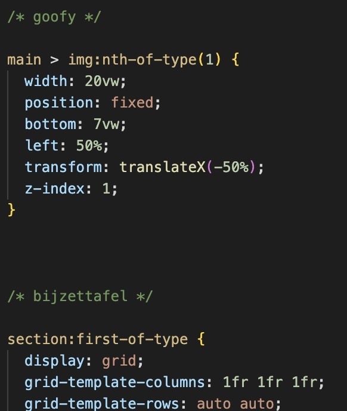
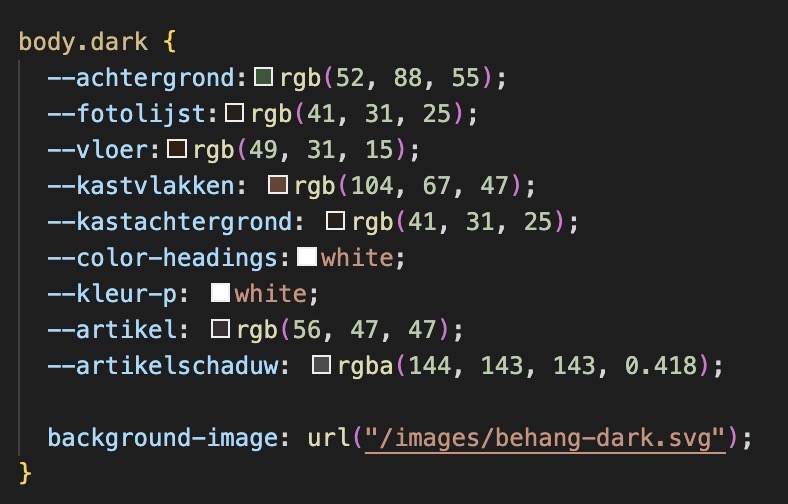

# Procesverslag
Markdown is een simpele manier om HTML te schrijven.  
Markdown cheat cheet: [Hulp bij het schrijven van Markdown](https://github.com/adam-p/markdown-here/wiki/Markdown-Cheatsheet).

Nb. De standaardstructuur en de spartaanse opmaak van de README.md zijn helemaal prima. Het gaat om de inhoud van je procesverslag. Besteedt de tijd voor pracht en praal aan je website.

Nb. Door *open* toe te voegen aan een *details* element kun je deze standaard open zetten. Fijn om dat steeds voor de relevante stuk(ken) te doen.

## Jij

### Ontwerper:
Mila Smit

#### Je startniveau:
Mijn startniveau is: blauw, maar randje rood denk ik

Update: Ik denk toch dat ik rood ben.

# Je plan

  
De eerste versie/schets van je ontwerp & je persoonlijke uitdaging

  ### Onderzoek:
  

  ### De eerste versie/schets:
  Ik had eerst 2 ideeën getekend, maar mijn voorkeur ging eigenlijk al uit naar Goofy in de kamer.
  

  Na de eerste feedback sessie heb ik mijn schets iets concreter gemaakt.
  

  ### Je ambitie: 
  Aan deze technieken/punten wil ik werken:
  - Ik wil proberen elementen te 'tekenen' met CSS in plaats van alleen maar images te gebruiken. 
  - Ik wil juiste, semantische code gebruiken, en alleen classes en IDs gebruiken als het echt niet anders kan.
  - Ik wil de persoonlijkheid van mijn karakter goed terug laten komen in mijn ontwerp.
  - Ik wil een sterk concept hebben met genoeg interactie dat goed de veranderingen van mijn karakter laat zien.

 

## Voortgang/Feedback 1

  
Mijn bevindingen + wijzigingen (minimaal 5)

  ### Bevinding 1:
  De fotolijstjes op de achtergrond kunnen ook familiefoto's zijn, en dat je dan ook informatie krijgt over de familie van Goofy. Ik had eerst het idee om foto's van Goofy zelf daar te hangen.

  #### oplossing:
  Ik heb gezocht naar foto's van de familie van Goofy, want ik had tijdens mijn onderzoek wel al onderzoek gedaan naar zijn familie, maar ik had nog geen foto's. Die foto's heb ik in de lijstjes geplaatst.

  

  ### Bevinding 2:
  Goofy zelf laten bewegen, dat hij bijvoorbeeld bijna valt.

  #### oplossing:
  Ik heb dit niet gedaan omdat ik dan (denk ik) goofy helemaal zelf zou moeten maken, want ik kan een afbeelding niet veranderen. Ik had wel de hele afbeelding in zijn geheel kunnen laten bewegen maar dat vind ik niet mooi :), dus ik heb er voor gekozen om dit toch niet te doen.

  ### Bevinding 3:
  Zijn persoonlijkheid nog beter terug laten komen door kleine grapjes / foutjes toe te voegen. 

  ### oplossing:
  Ik heb achter 1 schilderij een gat in de muur gemaakt, omdat dat past bij zijn onhandigheid, maar ook bij zijn creatieve manier van oplossen. Ook verschijnt Max af en toe in beeld.

  
  

  ### Bevinding 4:
  De hoedjes naar zijn hoofd laten verplaatsen als je er op klikt, alsof hij ze opdoet.

  ### oplossing:
  Ik heb het na een paar eigen pogingen laten doen. Mijn eigen pogingen: 
  
   

  ### Bevinding 5:
  Nog andere decoratie toevoegen om het een huiselijkere sfeer te geven.

  ### oplossing:
  Ik heb behang toegevoegd, 2 lampen, een plantje, wat boeken en een kleed.

## Voortgang/Feedback 2

  
Mijn bevindingen + wijzigingen (minimaal 5)

  
  ### Bevinding 1:
  Ik moet mijn knoppen states geven zodat het duidelijk is dat er interactie plaats vindt.

  #### oplossing:
  Ik heb mijn knoppen (de hoeden) een hover en focus state gegeven. Aangezien er bij het klikken al iets gebeurd vond ik het niet nodig om ook een active state toe te voegen. Bij de hover state vliegt het hoedje omhoog, en bij de focus state komt er een gloed achter de hoedjes.

  
  
  

  ### Bevinding 2:
  De tekst kan nog in een soort strip lettertype zodat het nog beter past bij Goofy.

  #### oplossing:
  Ik heb de titel een font gegeven uit Google Fonts, DynaPuff, omdat ik daar wel iets mee wilde proberen, maar de p heb ik een standaardfont gegeven, namelijk Comic Sans. Dit font ziet er een beetje uit als een strip font en dat vond ik wel passen.

  

  ### Bevinding 3:
  Er zit nog niet veel structuur in mijn CSS

  ### Oplossing:
  Ik heb mijn code gestructureerd per onderdeel, en daar duidelijke titels boven gezet met wat ruimte zodat je weet dat er een nieuw onderdeel komt. 

  

  ### Bevinding 4:
  Ik moet bronnen in mijn CSS neerzetten, en sowieso beter mijn bronnen bijhouden.

  ### Oplossing:
  Ik hield in het begin mijn bronnen bijna niet bij maar dat komt ook omdat ik op heel veel verschillende websites kijk, en ze dan allemaal niet echt gebruik omdat ze niet vertellen wat ik zoek, en dan vergeet ik neer te zetten welke ik wel heb gebruikt. Ik heb een paar bronnen neergezet waarvan ik wist dat ik ze had gebruikt, en veel bronnen heb ik later nog een keer gebruikt en ze toen wel op de lijst gezet. 

  ### Bevinding 5:
  De tekstwolk lijkt nog niet echt alsof Goofy het zegt.

  ### Oplossing:
  Jasper heeft me een link gestuurd waarmee ik een vorm van een tekstwolk kan maken. Dat is de volgende link: https://bennettfeely.com/clippy/. Deze heb ik uiteindelijk niet gebruikt, Sarah heeft me laten zien hoe zij het driehoekje had gedaan en dat heb ik overgenomen.

  
  

## Voortgang/Feedback 3

  
Mijn bevindingen + wijzigingen (minimaal 5)

  
  ### Bevinding 1:
  de focus state van schilderijen is nog niet mooi.

  #### oplossing:
  Er zat eerst een soort gloed rand omheen, en ik heb nu de list items kleine gescaled, zodat er een bruine rand omheen komt.

  

  ### Bevinding 2:
  code controleren of er geen dubbele dingen staan

  #### oplossing:
  Ik heb mijn hele code gescand, en ben niks dubbels tegen gekomen, dus als het goed is klopt alles.

  ### Bevinding 3:
  Ik heb nog mijn bronnen niet in de css staan

  ### oplossing:
  Ik ben door mijn bronnenlijst gegaan, en per bron gezocht naar het stukje css waar ik het heb gebruikt, en daar bijgezet welke bron ik heb gebruikt. 

  

  ### Bevinding 4:
  In dark mode het behang nog van kleur laten veranderen.

  ### Oplossing:
  De img die ik had gemaakt veranderen voor een donkergroen, en dan in css gezet dat als het darkmode is, dan moet de background-image verandert worden. 

  

  ### Bevinding 5:
  Een lichtknop toevoegen en daarmee gaat de website naar darkmode.

  ### Oplossing:
  Ik heb gegoogled op 'change to dark mode with button' en kwam uiteindelijk op een website die ik heb overgetypt. Ik snap ongeveer wat er staat maar ik had het echt niet zelf gekund. Ik vind het wel een hele leuke toevoeging.

  

## Reflectie

  
Mijn eindresultaat & persoonlijke ontwikkeling

  ### Je uitkomst - karakteristiek screenshot(s):
  

  ### Dit ging goed/Heb ik geleerd: 
  Ik vond sowieso de hele opdracht erg leuk om te maken. Ik heb denk ik stiekem toch het meeste plezier gehad met het inrichten van het huisje. Wat ik vooral goed vond gaan is dat ik meteen ben gaan werken met vw, normaal gebruik ik altijd em of pixels, maar ik wilde graag met vw's leren werken en dat is nu ook mijn favoriet geworden. 

  Wat ik geleerd heb is een hoop javascript, weliswaar niet zelf geschreven, maar als ik het lees kan ik wel ongeveer begrijpen wat er gebeurd, en misschien kan ik het dan zelf toepassen in de toekomst. 

  Ook heb ik nog nooit een darkmode gemaakt, en dat ging eigenlijk ook heel goed. Toen besloot ik het nog uit te breiden met een knop, dat was wel een uitdaging maar het is me gelukt. 

  Verder vond ik het heel leuk om de kast te maken met css, en de fotogallerij. Daar heb ik nog wel een beetje mee zitten puzzelen, omdat ik sommige foto's groter wilde hebben.

  
  

  ### Dit was lastig/Is niet gelukt:
  Het is mij niet zelf gelukt om de hoedjes op het hoofd van goofy te krijgen in een beweging. Ik kreeg ze er wel naartoe maar dan ging het hoedje in een keer naar het hoofd, en ik wilde dat je kon zien dat hij er heen ging.

  Ook is het mij niet gelukt om nog een balletje door de kamer te laten stuiteren, maar dit was mij waarschijnlijk wel gelukt als ik nog meer tijd had. Ik heb het ook uiteindelijk laten zitten. het balletje stuiterde wel maar niet mooi.

  Ten slotte vind ik het heel vervelend dat een border het woordje 'solid' moet hebben want dat vergeet ik aldoor en het heeft ervoor gezorgd dat ik heel lang bezig ben geweest met mijn kast en fotogallerij.

## Bronnenlijst

continu bijhouden terwijl je werkt

Nb. Wees specifiek ('css-tricks' als bron is bijv. niet specifiek genoeg).

1. https://stackoverflow.com/questions/2005954/center-a-positionfixed-element. Om goofy te centreren. (left 50%, transformX(-50%))
2. https://www.w3schools.com/CSSREF/pr_pos_z-index.php. Om de vloer op de achtergrond te krijgen.
3. https://css-tricks.com/snippets/css/a-guide-to-flexbox/. Voor alles wat ik met flex moet doen.
4. https://css-tricks.com/snippets/css/complete-guide-grid/. Voor alles wat ik met grid moet doen.
5. https://disney.fandom.com/wiki/Goofy_Through_the_Years. Hielp me met de tijdlijn van Goofy.
6. https://disney.fandom.com/wiki/Goofy. Alles over Goofy.
7. https://www.w3schools.com/css/css3_buttons.asp. Om te kijken hoe ik een button allemaal kon stylen. Vooral om te kijken hoe ik heb onzichtbaar kan maken.
8. https://developer.mozilla.org/en-US/docs/Web/CSS/filter-function/drop-shadow. Voor de focus states van de buttons.
9. https://developer.mozilla.org/en-US/docs/Web/CSS/background-repeat. Voor het behang.
10. https://projects.verou.me/bubbly/. Voor het driehoekje bij de tekstwolkjes.
11. https://developer.mozilla.org/en-US/docs/Web/CSS/transform-origin. Voor het schilderij laten draaien met boven als vaste punt.
12. https://codepen.io/adhuham/pen/BaNroxd. Gekopieerd om met het lichtknopje van light naar darkmode te gaan. Zou ik misschien een beetje kunnen uitleggen.
12. https://developer.mozilla.org/en-US/docs/Web/CSS/CSS_Animations/Using_CSS_animations. Om te kijken wat alle properties ook alweer betekenen.
13. Heel veel Rosella.

